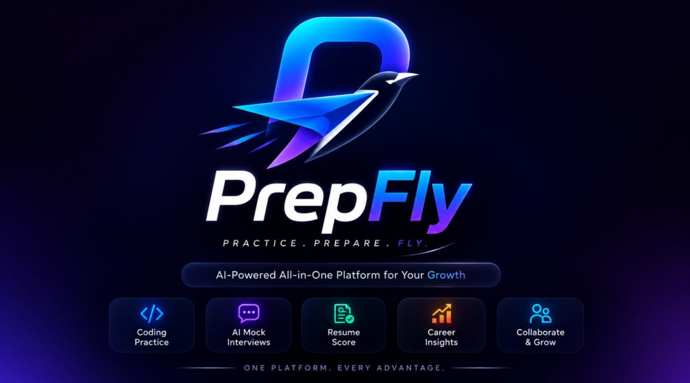
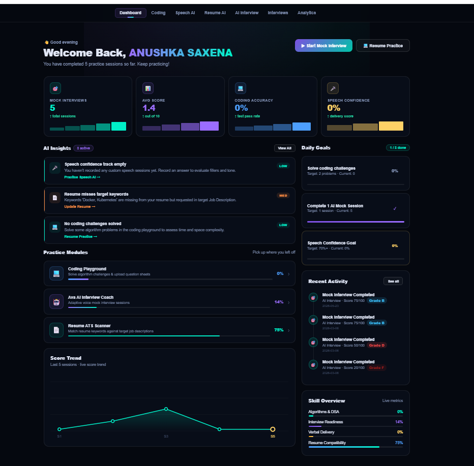
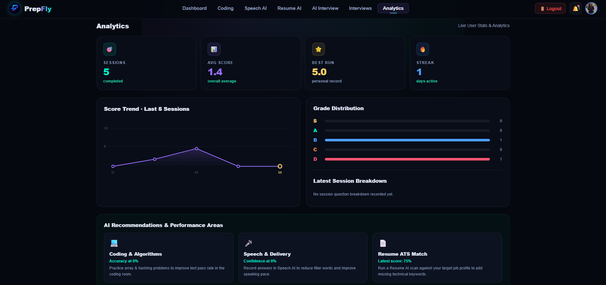
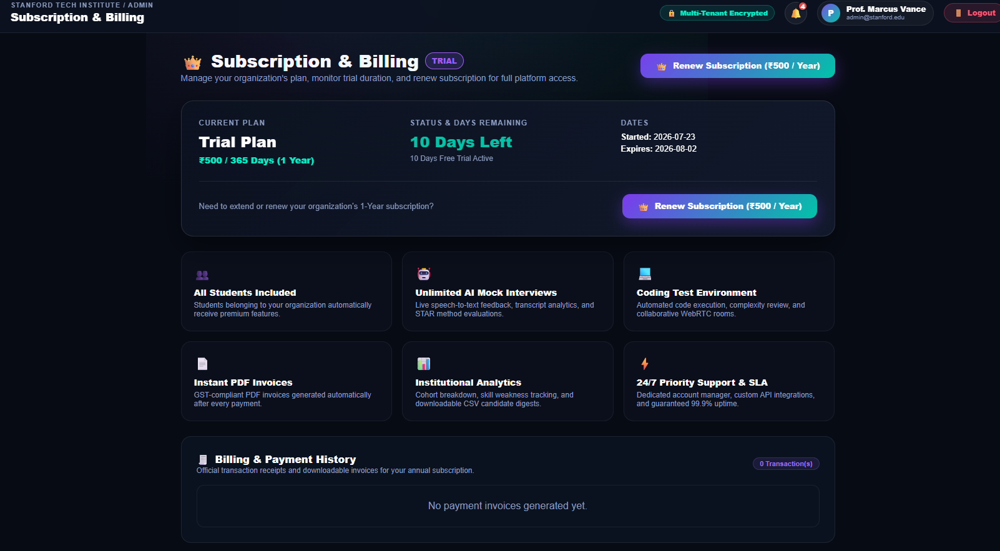
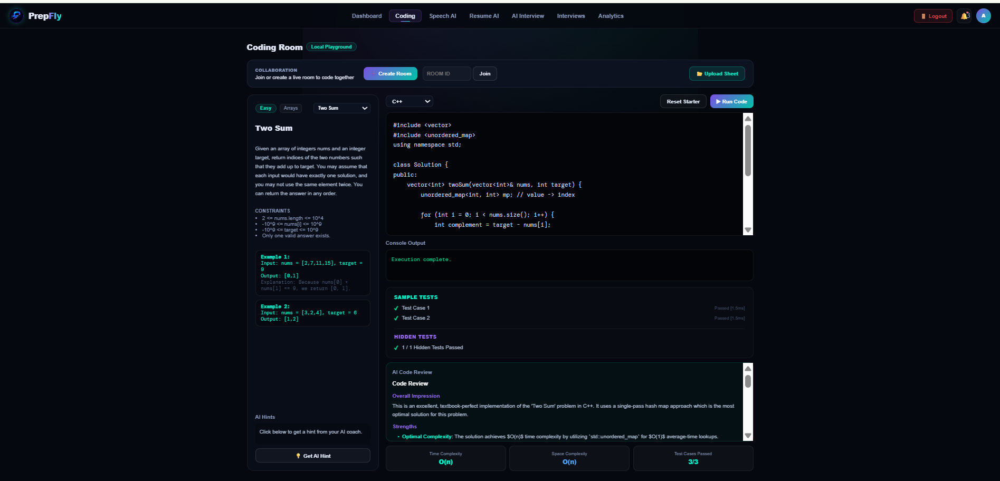
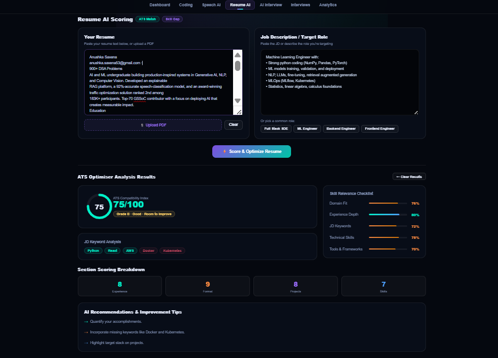
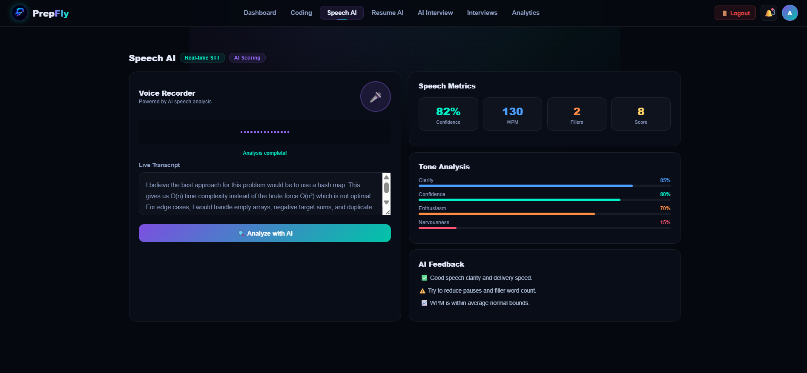

<div align="center">

# 🚀 PrepFly

### *AI-Powered Placement Preparation Platform for Computer Science Students*

Transforming interview preparation with AI-driven mock interviews, coding assessments, resume intelligence, and real-time performance analytics.


**[🌐 Live App](https://prepfly.vercel.app)** · **[⚙️ API](https://prepfly.up.railway.app)** · **[🐛 Report a Bug](https://github.com/anushkasaxena07/PrepFly/issues)** · **[✨ Request a Feature](https://github.com/anushkasaxena07/PrepFly/issues)**

</div>

---

## 🌐 Live Demo

| | |
|---|---|
| 🎯 **Live App** | [prepfly.vercel.app](https://prepfly.vercel.app) |
| ⚙️ **Backend API** | [prepfly.up.railway.app](https://prepfly.up.railway.app) |
| 📦 **Repository** | [github.com/anushkasaxena07/PrepFly](https://github.com/anushkasaxena07/PrepFly) |

> 💡 Try it out with a demo resume and experience a full AI mock interview in under 5 minutes.

---

## 📸 Screenshots

<div align="center">

| Logo | Student Dashboard |
|:---:|:---:|
|  |  |

| Student Profile | Admin Dashboard |
|:---:|:---:|
|  |  |

| Super Admin Dashboard | Report Page |
|:---:|:---:|
|  |  |

| Subscription & Billing | Coding Assessment |
|:---:|:---:|
|  |  |

| Creating Coding Challenge | Resume Analysis |
|:---:|:---:|
|  |  |

| Speech Analysis | AI Interview *(with Ava)* |
|:---:|:---:|
|  | 🔜 *Coming soon* |

| Peer-to-Peer Interview | |
|:---:|:---:|
| 🔜 *Coming soon* | |

</div>

> 📁 Add your screenshots to a `docs/screenshots/` folder in the repo root, matching the filenames above. The **AI Interview (Ava)** and **Peer-to-Peer Interview** screenshots will be added soon.

---

## 📖 About

Preparing for placements usually means juggling multiple websites—one for coding, another for resumes, another for mock interviews, and yet another for tracking progress.

**PrepFly** brings everything together into a single platform.

Designed specifically for **Computer Science students**, it combines AI-powered interviews, coding assessments, resume analysis, recruiter dashboards, and placement analytics into one seamless experience.

Whether you're preparing for your first internship or your dream software engineering role, PrepFly helps you identify weaknesses, practice smarter, and track measurable improvement.

---

# ✨ Features

## 👨‍🎓 Student Portal

- 🎤 AI Voice Mock Interviews (with **Ava**, your AI interviewer)
- 🤝 Peer-to-Peer Mock Interviews
- 📄 Resume-Based Interview Generation
- 🧠 Technical + HR + Behavioral Interviews
- 💻 Coding Assessment Environment
- 📊 AI Resume Score & ATS Analysis
- 🗣 Speech & Communication Analysis
- 📈 Performance Dashboard
- 📑 Downloadable PDF Reports
- 🎯 Personalized Improvement Suggestions
- 📜 Interview History
- 💬 Support & Feedback System

---

## 🏫 Admin Portal

- 📚 Central Question Bank
- 🤖 AI Question Generation
- 📊 Student Performance Analytics
- 📈 Placement Readiness Dashboard
- 📥 PDF & Excel Report Generation
- 👨‍💼 Student Management
- 📢 Announcement & Notification System
- 📝 Interview Configuration
- 🎯 Coding Assessment Management

---

## 👑 Super Admin

- 🏢 Organization Management
- 💳 Subscription Management
- 📈 Revenue Dashboard
- 📨 Feedback Management
- 🔐 Multi-Tenant Management
- ⚙ Platform Configuration
- 📊 Global Analytics

---

# 🏗 Architecture

```
                  React + Vite
                       │
                       │
                 HTTPS REST API
                       │
                 Flask Backend
                       │
        ┌──────────────┼──────────────┐
        │              │              │
    Supabase      Gemini AI      Judge0 API
 PostgreSQL         Interview      Coding
        │
 Supabase Storage
```

---

# 🧠 Core Modules

### 🎤 AI Interview Engine

Conducts realistic voice interviews with **Ava**, PrepFly's AI interviewer, based on:

- Resume
- Selected Role
- Experience Level
- Difficulty
- Interview Type

### 🤝 Peer-to-Peer Interview

Practice mock interviews live with fellow students, swapping the roles of interviewer and candidate for realistic, human-driven practice.

---

### 💻 Coding Module

Supports coding assessments with:

- Multiple Languages
- Hidden Test Cases
- Execution Reports
- Runtime Analysis

---

### 📄 Resume Intelligence

Automatically evaluates:

- ATS Compatibility
- Formatting
- Keywords
- Missing Skills
- Resume Quality Score

---

### 📊 Analytics

Tracks:

- Interview Progress
- Coding Performance
- Communication Skills
- Placement Readiness
- Historical Improvement

---

# 🛠 Tech Stack

### Frontend

- React
- Vite
- Tailwind CSS
- React Router

### Backend

- Flask
- Python

### Database

- Supabase PostgreSQL

### Authentication

- Supabase Auth

### Storage

- Supabase Storage

### AI

- Google Gemini

### Payments

- Razorpay

### Deployment

- Vercel (Frontend)
- Railway (Backend)

---

# 📂 Project Structure

```
PrepFly
│
├── f_frontend/
│
├── f_backend/
│   ├── services/
│   ├── uploads/
│   ├── app.py
│   ├── payment.py
│   ├── subscription.py
│   ├── webhook.py
│   └── requirements.txt
│
└── scraper/
```

---

# 🚀 Getting Started

### Clone Repository

```bash
git clone https://github.com/anushkasaxena07/PrepFly.git
cd PrepFly
```

---

### Backend

```bash
cd f_backend

pip install -r requirements.txt

python app.py
```

---

### Frontend

```bash
cd f_frontend

npm install

npm run dev
```

---

### Environment Variables

Create a `.env` file inside `f_backend/` with the following keys before running the backend:

```
GEMINI_API_KEY=
SUPABASE_URL=
SUPABASE_SERVICE_KEY=
SMTP_EMAIL=
SMTP_PASSWORD=
GOOGLE_CLIENT_ID=
RAZORPAY_KEY_ID=
RAZORPAY_KEY_SECRET=
JWT_SECRET_KEY=
FRONTEND_URL=
```

---

# 🌟 Why PrepFly?

Unlike traditional placement preparation platforms, PrepFly doesn't just conduct interviews—it understands the student's journey.

Every interview, coding challenge, and resume analysis contributes to a personalized learning path, helping students continuously improve instead of simply receiving scores.

---

# 📊 Roadmap

- [x] AI Mock Interviews (Ava)
- [x] Resume Analysis
- [x] Coding Assessments
- [x] PDF Reports
- [x] Admin Dashboard
- [x] Super Admin Dashboard
- [x] Feedback System
- [x] Subscription Management
- [ ] Peer-to-Peer Live Interview Screenshots & Docs
- [ ] Live Coding Collaboration
- [ ] Company-Specific Interview Simulation
- [ ] Mobile Application

---

# 🤝 Contributing

Contributions, feature requests, and suggestions are always welcome.

If you have an idea that can improve PrepFly, feel free to open an [issue](https://github.com/anushkasaxena07/PrepFly/issues) or submit a pull request.

---

# 📜 License

This project is licensed under the MIT License.

---

<div align="center">

### 💙 Built to help Computer Science students prepare with confidence.

**If you found this project useful, consider giving it a ⭐ on GitHub!**

</div>
